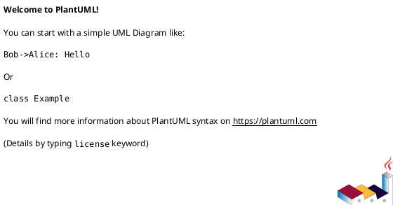

# Объектно-ориентированное программирование<br>Лекция 1. Концепции ООП и первые шаги в Python

Объекты и классы. Атрибуты и методы. Состояние и поведение объектов. Разница между парадигмами. Определение классов в Python, создание экземпляров. Использование `__init__`.

---

# Объектно-ориентированное программирование, классы и объекты

**Объектно-ориентированное программирование (ООП)** — методология программирования, основанная на представлении программы в виде совокупности объектов, каждый из которых является экземпляром определённого класса, а классы образуют иерархию наследования.

**Класс** — в объектно-ориентированном программировании, представляет собой шаблон для создания объектов, обеспечивающий начальные значения состояний: инициализация полей-переменных и реализация поведения функций или методов.

**Объект** — некоторая сущность в цифровом пространстве, обладающая определённым состоянием и поведением, имеющая определенные свойства (поля) и операции над ними (методы). Как правило, при рассмотрении объектов выделяется то, что объекты принадлежат одному или нескольким классам, которые определяют поведение (являются моделью) объекта.

---

# Классы и объекты

1. **Класс** описывает множество объектов, имеющих общую структуру и обладающих одинаковым поведением. Класс - это шаблон кода, по которому создаются объекты.
2. Данные внутри класса делятся на свойства и методы. **Свойства класса** (они же поля) - это характеристики объекта класса. Они описывают **состояние** объекта.
3. **Методы класса** - это функции, с помощью которых можно оперировать данными класса. Они описывают **поведение** объекта.
4. **Объект** - это конкретный представитель класса.
5. Объект класса и **экземпляр класса** - это одно и то же.

::center

> Класс = Свойства + Методы

::

---

# Пример

::center
<v-switch>
<template #0>



</template>
<template #1>


</template>
<template #2>


</template>
</v-switch>
::

---

# Разница между парадигмами

| Процедурное программирование                                                                       | Объектно-ориентированное<br>программирование                                                                                                                             |
| -------------------------------------------------------------------------------------------------- | ------------------------------------------------------------------------------------------------------------------------------------------------------------------------ |
| Basic, C, Pascal, Go                                                                               | C++, Java, Python, ...                                                                                                                                                   |
| Главное - код для обработки данных, сами данные имеют второстепенное значение                      | Главное в программе - данные. Именно они определяют, какие методы будут использоваться для их обработки. Т.е. данные первичны, код для обработки этих данных - вторичен. |
| Простые программы, где весь функционал можно реализовать несколькими десятками процедур/функций.   | Программа разбивается на объекты. Каждый объект отвечает за собственные данные и их обработку.                                                                           |
| Много дубликации кода и дублирование данных.                                                       | Уменьшается дупликация кода.                                                                                                                                             |
| Все данные внутри процедуры видны только локально, а значит их нельзя использовать в другом месте. | Упрощается и ускоряется процесс написания программ.                                                                                                                      |

---

# Разница между парадигмами. Пример

<v-switch>
<template #0>

<<< @/code/1/example_fun.py python

</template>

<template #1>

<<< @/code/1/example_oop.py python

</template>
</v-switch>

---

# Классы и объекты в Python

````md magic-move
```python
class <название_класса>:
    <тело_класса>

<имя_объекта> = <имя_класса>()
```

```python
class Car:
    pass

car_object = Car()
```
````

---

# Атрибуты класса в Python

> **Атрибут** - это любой элемент класса или объекта.

Все атрибуты можно разделить на 2 группы:

1. Встроенные (служебные) атрибуты
1. Пользовательские атрибуты

---

# Атрибуты класса в Python <br>Встроенные атрибуты

| Атрибут                        | Назначение                                                                 | Тип     |
| ------------------------------ | :------------------------------------------------------------------------- | ------- |
| `__new__(cls[, ...])`          | Конструктор. Создает экземпляр (объект) класса                             | Функция |
| `__init__(self[, ...])`        | Инициализатор. Принимает свежесозданный объект класса из конструктора      | Функция |
| `__del__(self)`                | Деструктор. Вызывается при удалении объекта сборщиком мусора               | Функция |
| `__str__(self)`                | Возвращает строковое представление объекта                                 | Функция |
| `__hash__(self)`               | Возвращает хэш-сумму объекта                                               | Функция |
| `__setattr__(self, attr, val)` | Создает новый атрибут для объекта класса с именем `attr` и значением `val` | Функция |
| `__doc__`                      | Документация класса                                                        | Строка  |
| `__dict__`                     | Словарь, в котором хранится пространство имен класса                       | Словарь |

---

# Разница между `__new__` и `__init__`

В Python создание объекта происходит в два этапа:

| Метод                 | Назначение        | Когда вызывается        | Что делает                                                       |
| --------------------- | ----------------- | ----------------------- | ---------------------------------------------------------------- |
| `__new__(cls, ...)`   | **Конструктор**   | Перед созданием объекта | Создает и возвращает новый пустой объект класса                  |
| `__init__(self, ...)` | **Инициализатор** | После создания объекта  | Заполняет объект начальными значениями (инициализация состояния) |

---

# Разница между `__new__` и `__init__`

```python
class Example:
    def __new__(cls):
        print("Создание объекта (__new__)")
        return super().__new__(cls)

    def __init__(self):
        print("Инициализация объекта (__init__)")

obj = Example()
```

<br>

```console {}{lines:false}
Создание объекта (__new__)
Инициализация объекта (__init__)
```

---

# Атрибуты класса в Python <br>Пользовательские атрибуты

Список атрибутов класса / объекта можно получить с помощью команды dir().

````md magic-move
```python
class Phone:
    pass

print(dir(Phone))
# ['__class__', '__delattr__', '__dict__', '__dir__', '__doc__', '__eq__',
# '__firstlineno__', '__format__', '__ge__', '__getattribute__', '__getstate__',
# '__gt__', '__hash__', '__init__', '__init_subclass__', '__le__', '__lt__',
# '__module__', '__ne__', '__new__', '__reduce__', '__reduce_ex__', '__repr__',
# '__setattr__', '__sizeof__', '__static_attributes__', '__str__', '__subclasshook__',
# '__weakref__']
```

```python
class Phone:
    color = 'Grey'

    def turn_on(self):
        pass

    def call(self):
        pass

print(dir(Phone))
# ['__class__', '__delattr__', '__dict__', '__dir__', '__doc__', '__eq__',
# ...
# '__weakref__', 'call', 'color', 'turn_on']
```
````

---

# Аттрибуты

> Первым аргументом любого метода является`self` - ссылка на объект, вызвавший метод

````md magic-move
```python
class MyClass:
    def __init__(self):
        self.x = 10
        self.y = 20

obj = MyClass()
setattr(obj, 'z', 30)
print(f"{getattr(obj, "z") = }")
# obj.z = 30
```

```python
class MyClass:
    def __init__(self):
        self.x = 10
        self.y = 20

obj = MyClass()
obj.d = 40
print(f"{obj.d = }")
# obj.d = 40
```
````

---

# Поля (свойства) класса в Python

Поля(они же свойства или переменные) можно (так же условно) разделить на две группы:

- Статические поля
- Динамические поля

---

# Поля (свойства) класса в Python<br>Статические поля

Это переменные, которые объявляются внутри тела класса и создаются тогда, когда создается класс.

```python
class Phone:
    # Статические поля (переменные класса)
    default_color = 'Grey'
    default_model = 'C385'

```

---

# Поля (свойства) класса в Python<br>Динамические поля

Это переменные, которые создаются на уровне экземпляра класса. Для создания динамического свойства необходимо обратиться к `self` внутри метода:

```python
class Phone:
    # Статические поля (переменные класса)
    default_color = 'Grey'
    default_model = 'C385'

    def __init__(self, color, model):
        # Динамические поля (переменные объекта)
        self.color = color
        self.model = model

my_phone_red = Phone('Red', 'I495')
```
