# Объектно-ориентированное программирование<br>Лекция 11: Структурные паттерны (Часть 1)

Adapter (Адаптер). Facade (Фасад). Bridge (Мост). Proxy (Заместитель).

---

# Структурные паттерны программирования

В структурных паттернах рассматривается вопрос о том, как из классов и объектов образуются более крупные структуры.

Структурные паттерны уровня класса используют наследование для составления композиций из интерфейсов и реализаций.

Вместо композиции интерфейсов или реализаций структурные паттерны уровня объекта компонуют объекты для получения новой функциональности. Дополнительная гибкость в этом случае связана с возможностью изменить композицию объектов во время выполнения, что недопустимо для статической композиции классов.

---

# Паттерн Адаптер (`Adapter`)

::center

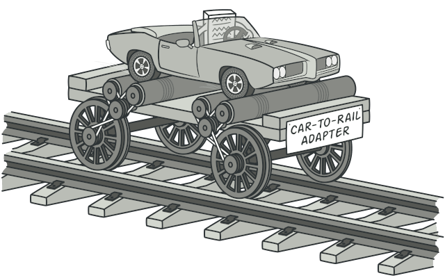

::

---

# Паттерн Адаптер (`Adapter`)

Преобразует интерфейс одного класса в интерфейс другого, который ожидают клиенты. Адаптер обеспечивает совместную работу классов с несовместимыми интерфейсами, которая без него была бы невозможна.

Используется, когда вы:

::v-clicks

- хотите использовать существующий класс, но его интерфейс не соответствует вашим потребностям;
- собираетесь создать повторно используемый класс, который должен взаимодействовать с заранее неизвестными или не связанными с ним классами, имеющими несовместимые интерфейсы;
- (только для адаптера объектов!) нужно использовать несколько существующих подклассов, но непрактично адаптировать их интерфейсы путем порождения новых подклассов от каждого. В этом случае адаптер объектов может приспосабливать интерфейс их общего родительского класса.
  ::

---

# Паттерн Адаптер (`Adapter`)

::center

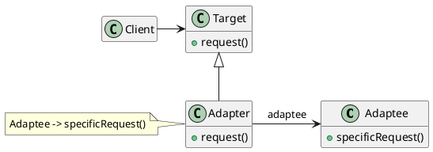

::

---

# Паттерн Адаптер (`Adapter`)

```python {*|1-3|2|5-7|6|9-16|10-11|13-16|14|16|18-21}{maxHeight: '420px'}
class OldSystem:
    def get_data_xml(self):
        return "<data>123</data>"

class NewSystem:
    def process_json(self, json_data):
        print(f"Processing: {json_data}")

class Adapter:
    def __init__(self, old_system):
        self.old_system = old_system

    def get_data_json(self):
        xml = self.old_system.get_data_xml()
        # Упрощенная логика конвертации
        return {"data": xml.replace("<data>", "").replace("</data>", "")}

# Клиент работает с новым форматом, но получает данные из старого
old = OldSystem()
adapter = Adapter(old)
NewSystem().process_json(adapter.get_data_json())
```

---

# Результаты

Адаптер класса:

::v-clicks{at: 0}

- <span v-mark.highlight.yellow>адаптирует `Adaptee` к `Target`, перепоручая действия конкретному классу `Adaptee`</span>. Поэтому данный паттерн не будет работать, если мы захотим одновременно адаптировать класс и его подклассы;
- позволяет адаптеру `Adapter` <span v-mark.highlight.yellow="{multiline: true}">заместить некоторые операции адаптируемого класса `Adaptee`</span>, так как `Adapter` есть не что иное, как подкласс `Adaptee`;
- <span v-mark.highlight.yellow>вводит только один новый объект</span>. Чтобы добраться до адаптируемого класса, не нужно никакого дополнительного обращения по указателю.
  ::

---

# Результаты

Адаптер объектов:

::v-clicks

- позволяет одному адаптеру `Adapter` <span v-mark.highlight.yellow="{multiline: true}">работать со многим адаптируемыми объектами `Adaptee`</span>, то есть с самим `Adaptee` и его подклассами (если таковые имеются). Адаптер может добавить новую функциональность сразу всем адаптируемым объектам;
- <span v-mark.highlight.yellow>затрудняет замещение операций класса `Adaptee`</span>. Для этого потребуется породить от `Adaptee` подкласс и заставить `Adapter` ссылаться на этот подкласс, а не на сам `Adaptee`.
  ::

---

# Паттерн Фасад (Facade)

::center

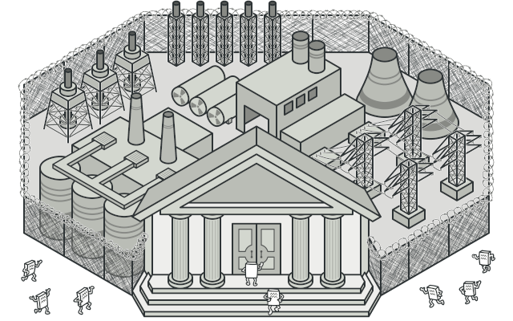

::

---

# Паттерн Фасад (Facade)

**Фасад** - паттерн, структурирующий объекты.

Предоставляет унифицированный интерфейс вместо набора интерфейсов некоторой подсистемы. Фасад определяет интерфейс более высокого уровня, который упрощает использование подсистемы.

---

# Паттерн Фасад (Facade)

::center

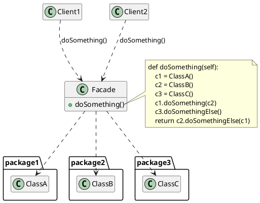

::

---

# Паттерн Фасад (Facade)

```python {*|1-4|6-7|9-18|10-12|14-18|20-21}{maxHeight: '420px'}
class CPU:
    def freeze(self): print("CPU freezed")
    def jump(self, position): print(f"CPU jump to {position}")
    def execute(self): print("CPU execute")

class Memory:
    def load(self, position, data): print(f"Memory load {data} to {position}")

class ComputerFacade:
    def __init__(self):
        self.cpu = CPU()
        self.memory = Memory()

    def start(self):
        self.cpu.freeze()
        self.memory.load(0, "BOOT_LOADER")
        self.cpu.jump(0)
        self.cpu.execute()

# Клиенту нужна только одна кнопка
ComputerFacade().start()
```

---

# Паттерн Фасад (Facade)

Используйте паттерн фасад, когда вы:

- <span v-mark.highlight.yellow>хотите предоставить простой интерфейс к сложной подсистеме</span>. Часто подсистемы усложняются по мере развития. Применение большинства паттернов приводит к появлению меньших классов, но в большем количестве. Такую подсистему проще повторно использовать и настраивать под конкретные нужды, но вместе с тем применять подсистему без настройки становится труднее. Фасад предлагает некоторый вид системы по умолчанию, устраивающий большинство клиентов. И лишь те объекты, которым нужны более широкие возможности настройки, могут обратиться напрямую к тому, что находится за фасадом;

---

# Паттерн Фасад (Facade)

- <span v-mark.highlight.yellow>между клиентами и классами реализации абстракции существует много зависимостей</span>. Фасад позволит отделить подсистему как от клиентов, так и от других подсистем, что, в свою очередь, способствует повышению степени независимости и переносимости;
- вы хотите <span v-mark.highlight.yellow>разложить подсистему на отдельные слои</span>. Используйте фасад для определения точки входа на каждый уровень подсистемы. Если подсистемы зависят друг от друга, то зависимость можно упростить, разрешив подсистемам обмениваться информацией только через фасады.

---

# Паттерн Мост (Bridge)

::center

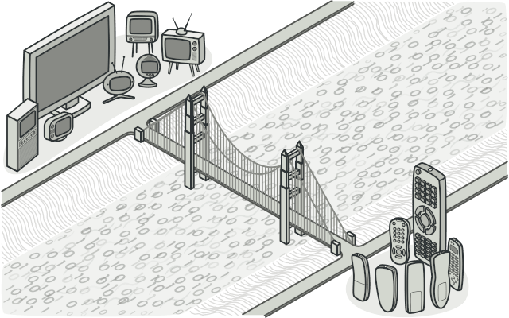

::

---

# Паттерн Мост (Bridge)

**Мост** - паттерн, структурирующий объекты.

Отделить абстракцию от ее реализации так, чтобы то и другое можно было изменять независимо.

---

# Паттерн Мост (Bridge)

::center

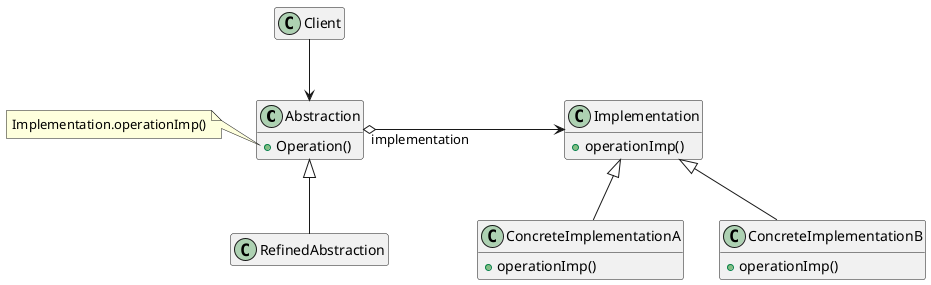

::

---

# Паттерн Мост (Bridge)

<v-switch>

<template #0>

::center

```plantuml
@startuml
hide empty methods
hide empty members

class Circle
class Square

@enduml
```

::

</template>
<template #1>

::center

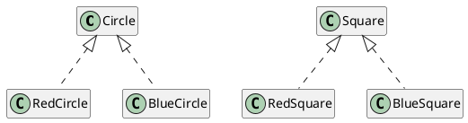

::
</template>
<template #2>

::center

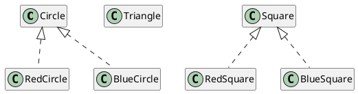

::
</template>
<template #3>

::center

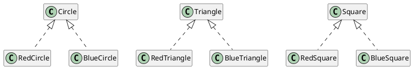

::
</template>
<template #4>

::center

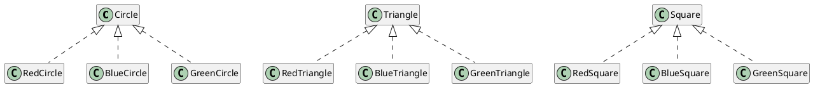

Количество классов растет как $N×M$ (декартово произведение). Это **«Ад наследования»**.

::
</template>
<template #5>

::center

```plantuml
@startuml
hide empty methods
hide empty members

abstract class Color

abstract class Shape{
    Color color
}

Color -o Shape

@enduml
```

::
</template>
<template #6>

::center

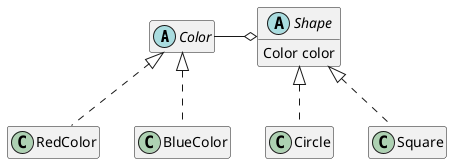

::
</template>

</v-switch>

---

# Паттерн Мост (Bridge)

```python {*|3-15|17-24|19-20|26-28,30-32|34-42}{maxHeight: '420px'}
from abc import ABC, abstractmethod

# === 1. Иерархия Реализации (Цвета) ===
class Color(ABC):
    @abstractmethod
    def fill(self):
        pass

class RedColor(Color):
    def fill(self):
        return "Красный"

class BlueColor(Color):
    def fill(self):
        return "Синий"

# === 2. Иерархия Абстракции (Фигуры) ===
class Shape(ABC):
    def __init__(self, color: Color):
        self.color = color  # <--- МОСТ (Bridge)

    @abstractmethod
    def draw(self):
        pass

class Circle(Shape):
    def draw(self):
        print(f"Рисуем Круг. Цвет: {self.color.fill()}")

class Square(Shape):
    def draw(self):
        print(f"Рисуем Квадрат. Цвет: {self.color.fill()}")

# === 3. Клиентский код ===
red = RedColor()
blue = BlueColor()

circle_red = Circle(red)
square_blue = Square(blue)

circle_red.draw()
square_blue.draw()
```

---

# Паттерн Мост (Bridge)

Используйте паттерн мост, когда:

- хотите <span v-mark.highlight.yellow>избежать постоянной привязки абстракции к реализации</span>. Так, например, бывает, когда реализацию необходимо выбирать во время выполнения программы;
- <span v-mark.highlight.yellow>и абстракции, и реализации должны расширяться новыми подклассами</span>. В таком случае паттерн мост позволяет комбинировать разные абстракции и реализации и изменять их независимо;
- <span v-mark.highlight.yellow>изменения в реализации абстракции не должны сказываться на клиентах</span>, то есть клиентский код не должен перекомпилироваться;
- <span v-mark.highlight.yellow>число классов начинает быстро расти</span>. Это признак того, что иерархию следует разделить на две части;
- вы хотите <span v-mark.highlight.yellow>разделить одну реализацию между несколькими объектами</span> (быть может, применяя подсчет ссылок), и этот факт необходимо скрыть от клиента.

---

# Результаты

- <span v-mark.highlight.yellow>отделение реализации от интерфейса</span>. Реализация больше не имеет постоянной привязки к интерфейсу. Реализацию абстракции можно конфигурировать во время выполнения. Объект может даже динамически изменять свою реализацию. Разделение классов `Abstraction` и `Implementor` устраняет также зависимости от реализации, устанавливаемые на этапе компиляции. Чтобы изменить класс реализации, вовсе не обязательно перекомпилировать класс `Abstraction` и его клиентов. Это свойство особенно важно, если необходимо обеспечить двоичную совместимость между разными версиями библиотеки классов.

---

# Результаты

- кроме того, такое разделение <span v-mark.highlight.yellow>облегчает разбиение системы на слои</span> и тем самым позволяет улучшить ее структуру. Высокоуровневые части системы должны знать только о классах `Abstraction` и `Implementor`;
- <span v-mark.highlight.yellow>повышение степени расширяемости</span>. Можно расширять независимо иерархии классов `Abstraction` и `Implementor`;
- <span v-mark.highlight.yellow>сокрытие деталей реализации от клиентов</span>. Клиентов можно изолировать от таких деталей реализации, как разделение объектов класса `Implementor` и сопутствующего механизма подсчета ссылок.

---

# Адаптер, фасад и мост

У паттернов адаптер и мост есть несколько общих атрибутов. Тот и другой повышают гибкость, вводя дополнительный уровень косвенности при обращении к другому объекту. Оба перенаправляют запросы другому объекту, используя иной интерфейс.

Основное различие между адаптером и мостом в их назначении.

- <span v-mark.highlight.yellow>Цель адаптера - устранить несовместимость между двумя существующими интерфейсами.</span> При разработке адаптера не учитывается, как эти интерфейсы реализованы и то, как они могут независимо развиваться в будущем. Он должен лишь обеспечить совместную работу двух независимо разработанных классов, так чтобы ни один из них не пришлось переделывать.
- С другой стороны, <span v-mark.highlight.yellow="{multiline: true}">мост связывает абстракцию с ее, возможно, многочисленными реализациями.</span> Данный паттерн предоставляет клиентам стабильный интерфейс, позволяя в то же время изменять классы, которые его реализуют.

---

# Адаптер, фасад и мост

Когда выясняется, что два несовместимых класса должны работать вместе, следует обратиться к адаптеру. Тем самым удастся избежать дублирования кода.

Наоборот, пользователь моста с самого начала понимает, что у абстракции может быть несколько реализаций и развитие того и другого будет идти независимо

Адаптер обеспечивает работу после того, как нечто спроектировано; мост - до того.

Фасад можно представлять себе как адаптер к набору других объектов. Но при такой интерпретации легко не заметить такой нюанс: <span v-mark.highlight.yellow="{multiline: true}">фасад определяет новый интерфейс, тогда как адаптер повторно использует уже имеющийся</span>. Адаптер заставляет работать вместе два существующих интерфейса, а не определяет новый.

---

# Паттерн Заместитель (Proxy)

::center

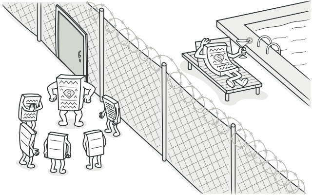

::

---

# Паттерн Заместитель (Proxy)

**Заместитель** - паттерн, структурирующий объекты.

Является суррогатом другого объекта и контролирует доступ к нему.

Паттерн заместитель применим во всех случаях, когда возникает необходимость сослаться на объект более изощренно, чем это возможно, если использовать простой указатель.

Примеры:

::v-clicks

- удаленный заместитель может предоставлять доступ к объекту в другом адресном пространстве;
- защищающий заместитель может ограничивать доступ к другому объекту;
- виртуальный заместитель может создавать тяжёлые объекты по требованию (изображения,файлы).
  ::

---

# Паттерн Заместитель (Proxy)

::center

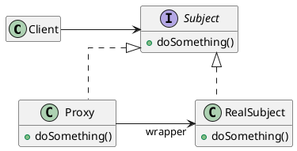

::

---

# Паттерн Заместитель (Proxy)

```python {*|1-10|4,6-7|12-20|13-15|17-20|18-19|20|22-26}{maxHeight: '420px'}
class RealImage:
    def __init__(self, filename):
        self.filename = filename
        self.load_from_disk()

    def load_from_disk(self):
        print(f"Loading {self.filename}...")

    def display(self):
        print(f"Displaying {self.filename}")

class ProxyImage:
    def __init__(self, filename):
        self.filename = filename
        self.real_image = None

    def display(self):
        if self.real_image is None:
            self.real_image = RealImage(self.filename) # Ленивая загрузка
        self.real_image.display()

# Картинка не грузится при создании прокси
img = ProxyImage("photo.jpg")
print("Прокси создан")
# Картинка грузится только сейчас
img.display()
```

---

# Паттерн Заместитель (Proxy). Результаты

- удаленный заместитель может скрыть тот факт, что объект находится в другом адресном пространстве;
- виртуальный заместитель может выполнять оптимизацию, например создание объекта по требованию;
- защищающий заместитель и «умная» ссылка позволяют решать дополнительные задачи при доступе к объекту.
