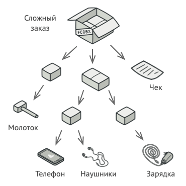
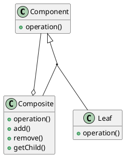
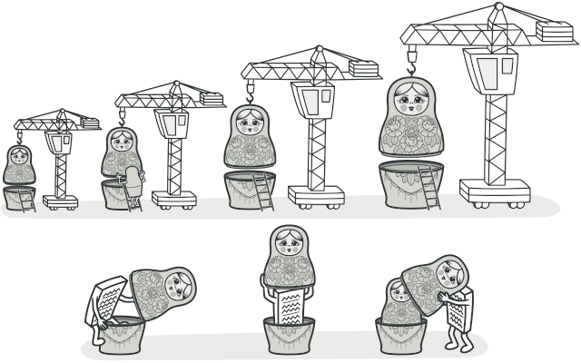
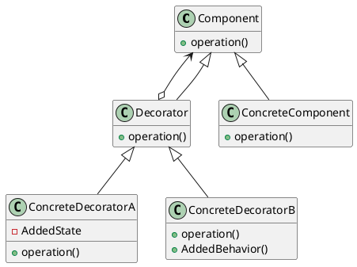
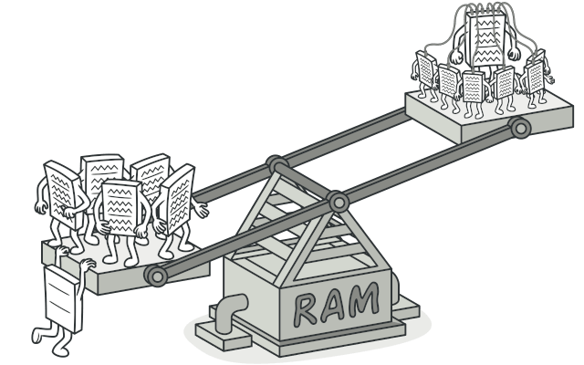
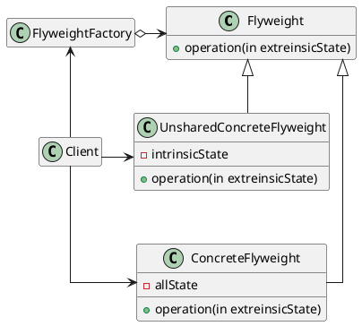

# Объектно-ориентированное программирование<br>Лекция 12: Структурные паттерны (Часть 2)

Composite (Компоновщик). Decorator (Декоратор, в т.ч. функции-декораторы). Flyweight (Приспособленец).

---

# Паттерн Компоновщик (Composite)

::center



::

---

# Паттерн Компоновщик (Composite)

**Компоновщик** - паттерн, структурирующий объекты.

Компонует объекты в древовидные структуры для представления иерархий часть-целое. Позволяет клиентам единообразно трактовать индивидуальные и составные объекты.

Используйте паттерн компоновщик, когда:

- нужно представить иерархию объектов вида часть-целое;
- хотите, чтобы клиенты единообразно трактовали составные и
  индивидуальные объекты.

---

# Паттерн Компоновщик (Composite)

::center



::

---

# Паттерн Компоновщик (Composite)

```python {*|3-5|7-13|12-13|15-26|15|18,20-21|23-26|24|28-39}{maxHeight: '420px'}
from abc import ABC, abstractmethod

class Component(ABC):
    @abstractmethod
    def get_size(self): pass

class File(Component):
    def __init__(self, name, size):
        self.name = name
        self.size = size

    def get_size(self):
        return self.size

class Folder(Component):
    def __init__(self, name):
        self.name = name
        self.children = []

    def add(self, component: Component):
        self.children.append(component)

    def get_size(self):
        total = sum(child.get_size() for child in self.children)
        print(f"Папка {self.name}: {total} байт")
        return total

# Использование
root = Folder("root")
img = File("photo.jpg", 1024)
doc = File("resume.pdf", 512)

subfolder = Folder("docs")
subfolder.add(doc)

root.add(img)
root.add(subfolder)

root.get_size()
```

---

# Паттерн Компоновщик (Composite). Результаты

- <span v-mark.highlight.yellow="{multiline: true}">определяет иерархии классов, состоящие из примитивных и составных объектов</span>. Из примитивных объектов можно составлять более сложные, которые, в свою очередь, участвуют в более сложных композициях и так далее. Любой клиент, ожидающий примитивного объекта, может работать и с составным;
- упрощает архитектуру клиента. <span v-mark.highlight.yellow="{multiline: true}">Клиенты могут единообразно работать с индивидуальными объектами и с составными структурами</span>. Обычно клиенту неизвестно, взаимодействует ли он с листовым или составным объектом. Это упрощает код клиента, поскольку нет необходимости писать функции, ветвящиеся в зависимости от того, с объектом какого класса они работают;

---

# Паттерн Компоновщик (Composite). Результаты

- <span v-mark.highlight.yellow="{multiline: true}">облегчает добавление новых видов компонентов.</span> Новые подклассы будут автоматически работать с уже существующими структурами и клиентским кодом. Изменять клиента при добавлении новых компонентов не нужно;
- <span v-mark.highlight.yellow="{multiline: true}">способствует созданию общего дизайна.</span> Однако такая простота добавления новых компонентов имеет и свои отрицательные стороны: становится <span v-mark.highlight.red="{multiline: true}">трудно наложить ограничения на то, какие объекты могут входить в состав композиции</span>. Иногда желательно, чтобы составной объект мог включать только определенные виды компонентов. Паттерн компоновщик не позволяет воспользоваться для реализации таких ограничений статической системой типов. Вместо этого следует проводить проверки во время выполнения.

---

# Паттерн Декоратор (Decorator)

::center



::

---

# Паттерн Декоратор (Decorator)

**Декоратор** - паттерн, структурирующий объекты.

Динамически добавляет объекту новые обязанности. Является гибкой альтернативой порождению подклассов с целью расширения функциональности.

Используйте паттерн декоратор:

- для динамического, прозрачного для клиентов добавления обязанностей объектам;
- для реализации обязанностей, которые могут быть сняты с объекта;
- когда расширение путем порождения подклассов по каким-то причинам неудобно или невозможно. Иногда приходится реализовывать много независимых расширений, так что порождение подклассов для поддержки всех возможных комбинаций приведет к комбинаторному росту их числа. В других случаях определение класса может быть скрыто или почему-либо еще недоступно,так что породить от него подкласс нельзя.

---

# Паттерн Декоратор (Decorator)

::center



::

---

# Паттерн Декоратор (Decorator)

```python {*|5-11|13-23|25-34|27-28|31,34|36-41|39-40|41|43-49|51-61|54-58|60-61}{maxHeight: '420px'}
from abc import ABC, abstractmethod
import base64
import zlib

# 1. Общий интерфейс
class DataSource(ABC):
    @abstractmethod
    def write(self, data: str): pass

    @abstractmethod
    def read(self) -> str: pass

# 2. Базовый компонент (Простая запись в файл)
class FileDataSource(DataSource):
    def __init__(self, filename):
        self.filename = filename

    def write(self, data: str):
        print(f"[Disk] Запись в файл {self.filename}: {data}")

    def read(self) -> str:
        print(f"[Disk] Чтение из файла {self.filename}")
        return "data"

# 3. Базовый Декоратор (принимает объект-источник)
class DataSourceDecorator(DataSource):
    def __init__(self, source: DataSource):
        self.wrappee = source

    def write(self, data: str):
        self.wrappee.write(data)

    def read(self) -> str:
        return self.wrappee.read()

# 4. Конкретный Декоратор: Шифрование
class EncryptionDecorator(DataSourceDecorator):
    def write(self, data: str):
        encrypted = f"ENC({data[::-1]})"
        print(f" -> Шифруем: {encrypted}")
        super().write(encrypted)

# 5. Конкретный Декоратор: Сжатие
class CompressionDecorator(DataSourceDecorator):
    def write(self, data: str):
        # Имитация сжатия
        compressed = f"ZIP({data[:5]}...)"
        print(f" -> Сжимаем: {compressed}")
        super().write(compressed)

# --- Использование ---

# Клиент настраивает "слоеный пирог":
# Данные -> Сжать -> Зашифровать -> Записать на диск
source = FileDataSource("secret_data.txt")
source = EncryptionDecorator(source)
source = CompressionDecorator(source)
# Обратите внимание: порядок обертки влияет на порядок выполнения!

print("--- Процесс записи ---")
source.write("MySensitiveInformation")
```

---

# Паттерн Декоратор (Decorator). Результаты

- бОльшая гибкость, нежели у статического наследования. Паттерн декоратор <span v-mark.highlight.yellow="{multiline: true}">позволяет более гибко добавлять объекту новые обязанности, чем было бы возможно в случае статического (множественного) наследования</span>. Декоратор может добавлять и удалять обязанности во время выполнения программы. При использовании же наследования требуется создавать новый класс для каждой дополнительной обязанности, что ведет к увеличению числа классов и, как следствие, к возрастанию сложности системы. Кроме того, применение нескольких декораторов к одному компоненту позволяет произвольным образом сочетать обязанности. Декораторы позволяют легко добавить одно и то же свойство дважды, но это может быть чревато ошибками;

---

# Паттерн Декоратор (Decorator). Результаты

- <span v-mark.highlight.yellow="{multiline: true}">позволяет избежать перегруженных функциями классов на верхних уровнях иерархии.</span> Декоратор разрешает добавлять новые обязанности по мере необходимости. Вместо того чтобы пытаться поддержать все мыслимые возможности в одном сложном, допускающем разностороннюю настройку классе, вы можете определить простой класс и постепенно наращивать его функциональность с помощью декораторов. В результате приложение уже не платит за неиспользуемые функции. Нетрудно также определять новые виды декораторов независимо от классов, которые они расширяют, даже если первоначально такие расширения не планировались. При расширении же сложного класса обычно приходится вникать в детали, не имеющие отношения к добавляемой функции;

---

# Паттерн Декоратор (Decorator). Результаты

- <span v-mark.highlight.yellow="{multiline: true}">декоратор и его компонент не идентичны.</span> Декоратор действует как прозрачное обрамление. Но декорированный компонент все же не идентичен исходному. При использовании декораторов это следует иметь в виду;
- <span v-mark.highlight.yellow="{multiline: true}">множество мелких объектов.</span> При использовании в проекте паттерна декоратор нередко получается система, составленная из большого числа мелких объектов, которые похожи друг на друга и различаются только способом взаимосвязи, а не классом и не значениями своих внутренних переменных. Хотя проектировщик, разбирающийся в устройстве такой системы, может легко настроить ее, но изучать и отлаживать ее очень тяжело.

---

# Паттерн Приспособленец (Flyweight)

::center



::

---

# Паттерн Приспособленец (Flyweight)

**Приспособленец** - паттерн, структурирующий объекты.
Использует разделение для эффективной поддержки множества мелких объектов.

Применяйте этот паттерн, когда выполнены все нижеперечисленные условия одновременно:

- в приложении используется большое число объектов;
- из-за этого накладные расходы на хранение высоки;
- большую часть состояния объектов можно вынести вовне;
- многие группы объектов можно заменить относительно небольшим количеством разделяемых объектов, поскольку внешнее состояние вынесено;
- приложение не зависит от идентичности объекта. Поскольку объекты приспособленцы могут разделяться, то проверка на идентичность возвратит «истину» для концептуально различных объектов.

---

# Паттерн Приспособленец (Flyweight)

::center



::

---

# Паттерн Приспособленец (Flyweight)

```python {*|3-14|7-11|13-14|16-26|28-36|30,33|35-36|40-46|48-58|51-52|54}{maxHeight: '420px'}
import sys

# 1. Приспособленец (Flyweight)
# Хранит общее состояние (Intrinsic State).
# Эти объекты НЕИЗМЕНЯЕМЫ и разделяются между тысячами транзакций.
class MerchantType:
    def __init__(self, name, category, icon_url, color_hex):
        self.name = name
        self.category = category
        self.icon = icon_url
        self.color = color_hex

    def render(self, amount, date):
        print(f"Отрисовка: {self.name} [{self.category}] | Сумма: {amount} | Дата: {date}")

# 2. Фабрика Приспособленцев
class MerchantFactory:
    _merchants = {}

    @classmethod
    def get_merchant_type(cls, name, category, icon, color):
        key = (name, category)
        if key not in cls._merchants:
            cls._merchants[key] = MerchantType(name, category, icon, color)
            print(f"[Factory] Создан новый тип магазина: {name}")
        return cls._merchants[key]

# 3. Контекст (Context)
class Transaction:
    def __init__(self, amount, date, merchant_type: MerchantType):
        self.amount = amount
        self.date = date
        self.merchant = merchant_type

    def show_in_app(self):
        self.merchant.render(self.amount, self.date)

# --- Использование ---

# Загружаем историю операций (имитация БД)
transactions_data = [
    (150, "10:00", "Uber", "Taxi"),
    (200, "10:30", "Uber", "Taxi"),
    (5000, "12:00", "Пятерочка", "Food"),
    (300, "18:00", "Uber", "Taxi"),
]

history = []

for amount, time, name, cat in transactions_data:
    # Получаем легкий "общий" объект
    m_type = MerchantFactory.get_merchant_type(name, cat, "icon.png", "#fff")
    # Создаем транзакцию
    t = Transaction(amount, time, m_type)
    history.append(t)

print(f"\nВсего транзакций: {len(history)}")
print(f"Всего объектов MerchantType в памяти: {len(MerchantFactory._merchants)}")
```

---

# Паттерн Приспособленец (Flyweight). Результаты

При использовании приспособленцев не исключены затраты на передачу, поиск или вычисление внутреннего состояния, особенно если раньше оно хранилось как внутреннее. Однако такие расходы с лихвой компенсируются экономией памяти за счет разделения объектов-приспособленцев. Экономия памяти возникает по ряду причин:

- уменьшение общего числа экземпляров;
- сокращение объема памяти, необходимого для хранения внутреннего состояния;
- вычисление, а не хранение внешнего состояния (если это действительно так).
  Чем выше степень разделения приспособленцев,тем существеннее экономия.

С увеличением объема разделяемого состояния экономия также возрастает. Самого большого эффекта удается добиться, когда суммарный объем внутренней и внешней информации о состоянии велик, а внешнее состояние вычисляется, а не хранится. Тогда разделение уменьшает стоимость хранения внутреннего состояния, а за счет вычислений сокращается память, отводимая под внешнее состояние.
