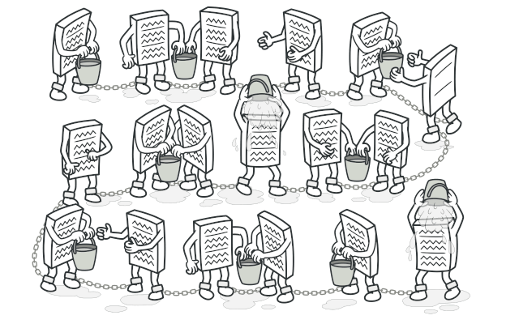
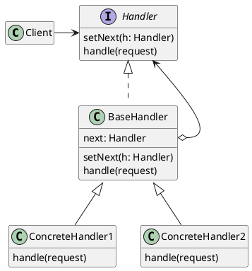
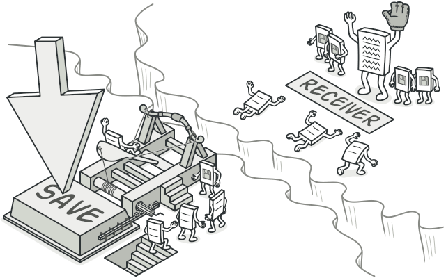
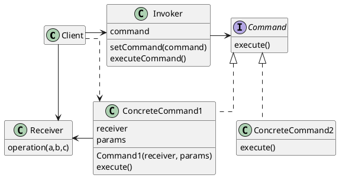
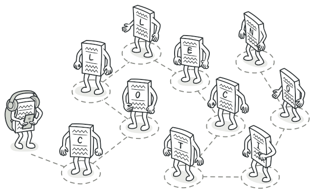
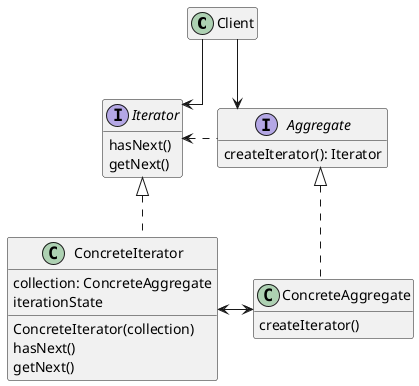
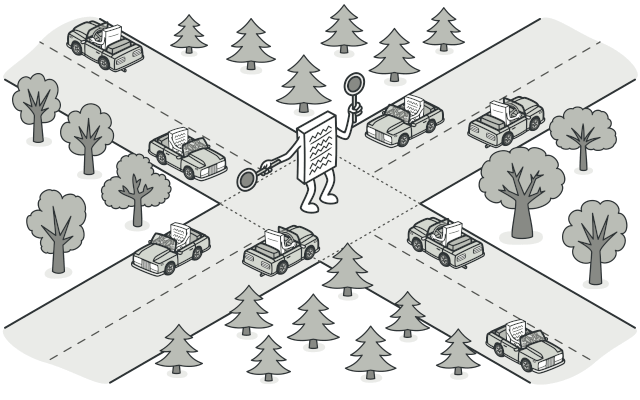
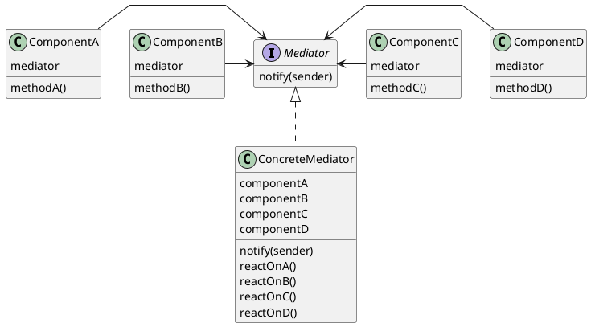
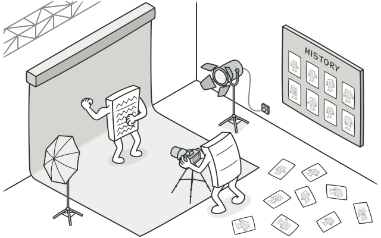
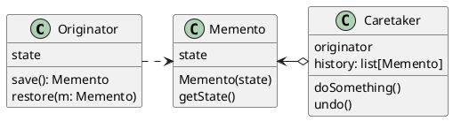

# Объектно-ориентированное программирование<br>Лекция 13: Поведенческие паттерны (Часть 1)

Chain of Responsibility (Цепочка обязанностей). Command (Команда). Iterator (Итератор). Mediator (Посредник). Memento (Хранитель).

---

# Поведенческие паттерны

- Паттерны поведения связаны с алгоритмами и распределением обязанностей между объектами. Речь в них идет не только о самих объектах и классах, но и о типичных способах взаимодействия.
- Паттерны поведения характеризуют сложный поток управления, который трудно проследить во время выполнения программы. При этом внимание акцентировано не на потоке управления как таковом, а на связях между объектами.
- В паттернах поведения уровня класса используется наследование - чтобы распределить поведение между разными классами.
- В паттернах поведения уровня объектов используется не наследование, а композиция.

---

# Паттерн Цепочка обязанностей (Chain of Responsibility)

::center

::

---

# Паттерн Цепочка обязанностей (Chain of Responsibility)

**Цепочка обязанностей** - паттерн поведения объектов.

Позволяет избежать привязки отправителя запроса к его получателю, давая шанс обработать запрос нескольким объектам. Связывает объекты-получатели в цепочку и передает запрос вдоль этой цепочки, пока его не обработают.

Используйте цепочку обязанностей, когда:

- есть более одного объекта, способного обработать запрос, причем настоящий обработчик заранее неизвестен и должен быть найден автоматически;
- вы хотите отправить запрос одному из нескольких объектов, не указывая явно, какому именно;
- набор объектов, способных обработать запрос, должен задаваться динамически.

---

# Паттерн Цепочка обязанностей (Chain of Responsibility)

::center



::

---

# Паттерн Цепочка обязанностей (Chain of Responsibility)

```python {*|1-11|2-3|5-8|10-11|13-19|15-17|18-19|21-24|26-29}{maxHeight: '420px'}
class Handler:
    def __init__(self, next_handler=None):
        self._next = next_handler

    def handle(self, request):
        res = self._process(request)
        if res and self._next:
            self._next.handle(request)

    def _process(self, request):
        return True # По умолчанию пропускаем дальше

class AuthHandler(Handler):
    def _process(self, request):
        if request.get("user") != "admin":
            print("403 Forbidden")
            return False # Прерываем цепочку
        print("Auth OK")
        return True

class LogHandler(Handler):
    def _process(self, request):
        print(f"Log: {request}")
        return True

# Сборка цепочки: Auth -> Log
chain = AuthHandler(LogHandler())
chain.handle({"user": "guest", "path": "/dashboard"}) # 403
chain.handle({"user": "admin", "path": "/dashboard"}) # Auth OK, Log...
```

---

# Паттерн Цепочка обязанностей (Chain of Responsibility) Результаты

- ослабление связанности. Этот паттерн освобождает объект от необходимости «знать», кто конкретно обработает его запрос. Отправителю и получателю ничего неизвестно друг о друге, а включенному в цепочку объекту - о структуре цепочки. Таким образом, цепочка обязанностей помогает упростить взаимосвязи между объектами. Вместо того чтобы хранить ссылки на все объекты, которые могут стать получателями запроса, объект должен располагать информацией лишь о своем ближайшем преемнике;
- дополнительная гибкость при распределении обязанностей между объектами. Цепочка обязанностей позволяет повысить гибкость распределения обязанностей между объектами. Добавить или изменить обязанности по обработке запроса можно, включив в цепочку новых участников или изменив ее каким-то другим образом. Этот подход можно сочетать со статическим порождением подклассов для создания специализированных обработчиков; - получение не гарантировано. Поскольку у запроса нет явного получателя, то нет и гарантий, что он вообще будет обработан: он может достичь конца цепочки и пропасть. Необработанным запрос может оказаться и в случае неправильной конфигурации цепочки.

---

# Паттерн Команда (Command)

::center

::

---

# Паттерн Команда (Command)

**Команда** - паттерн поведения объектов.

Инкапсулирует запрос как объект, позволяя тем самым задавать параметры клиентов для обработки соответствующих запросов, ставить запросы в очередь или протоколировать их, а также поддерживать отмену операций.

Используйте паттерн команда, когда хотите:

- параметризовать объекты выполняемым действием;
- определять, ставить в очередь и выполнять запросы в разное время;
- поддержать отмену операций;
- поддержать протоколирование изменений, чтобы их можно было выполнить повторно после аварийной остановки системы;
- структурировать систему на основе высокоуровневых операций, построенных из примитивных.

---

# Паттерн Команда (Command)

::center



::

---

# Паттерн Команда (Command)

```python {*|1-9|11-20|12-14|16-17|19-20|22-26}{maxHeight: '420px'}
class TextEditor:
    def __init__(self):
        self.text = ""

    def write(self, text):
        self.text += text

    def delete_last(self, count):
        self.text = self.text[:-count]

class WriteCommand:
    def __init__(self, editor, text):
        self.editor = editor
        self.text = text

    def execute(self):
        self.editor.write(self.text)

    def undo(self):
        self.editor.delete_last(len(self.text))

# Использование
editor = TextEditor()
cmd = WriteCommand(editor, "Hello")
cmd.execute() # editor.text = "Hello"
cmd.undo()    # editor.text = ""
```

---

# Паттерн Команда (Command)<br>Результаты

- команда разрывает связь между объектом, инициирующим операцию, и объектом, имеющим информацию о том, как ее выполнить;
- команды - это самые настоящие объекты. Допускается манипулировать ими и расширять их точно так же, как в случае с любыми другими объектами;
- из простых команд можно собирать составные. В общем случае составные команды описываются паттерном компоновщик;
- добавлять новые команды легко, поскольку никакие существующие классы изменять не нужно.

---

# Паттерн Итератор (Iterator)

::center

::

---

# Паттерн Итератор (Iterator)

**Итератор** - паттерн поведения объектов.

Предоставляет способ последовательного доступа ко всем элементам составного объекта, не раскрывая его внутреннего представления.

Используйте паттерн итератор:

- для доступа к содержимому агрегированных объектов без раскрытия их внутреннего представления;
- для поддержки нескольких активных обходов одного и того же агрегированного объекта;
- для предоставления единообразного интерфейса с целью обхода различных агрегированных структур (то есть для поддержки полиморфной итерации).

---

# Паттерн Итератор (Iterator)

::center



---

# Паттерн Итератор (Iterator)

```python {*|1-12|2-3,5-6|8-12|14-19}{maxHeight: '420px'}
class BookShelf:
    def __init__(self):
        self.books = []

    def add(self, book):
        self.books.append(book)

    # Магия итератора в Python
    def __iter__(self):
        # Используем генератор вместо создания отдельного класса Iterator
        for book in self.books:
            yield f"Книга: {book}"

shelf = BookShelf()
shelf.add("Python Basics")
shelf.add("Design Patterns")

for item in shelf: # Работает благодаря __iter__
    print(item)
```

---

# Паттерн Итератор (Iterator)<br>Результаты

- поддерживает различные виды обхода агрегата. Сложные агрегаты можно обходить по-разному. Например, для генерации кода и семантических проверок нужно обходить деревья синтаксического разбора. Генератор кода может обходить дерево во внутреннем или прямом порядке. Итераторы упрощают изменение алгоритма обхода - достаточно просто заменить один экземпляр итератора другим. Для поддержки новых видов обхода можно определить и подклассы класса Iterator;
- итераторы упрощают интерфейс класса Aggregate. Наличие интерфейса для обхода в классе Iterator делает излишним дублирование этого интерфейса в классе Aggregate. Тем самым интерфейс агрегата упрощается;
- одновременно для данного агрегата может быть активно несколько обходов. Итератор следит за инкапсулированным в нем самом состоянием обхода. Поэтому одновременно разрешается осуществлять несколько обходов агрегата.

---

# Паттерн Посредник (Mediator)

::center

::

---

# Паттерн Посредник (Mediator)

**Посредник** - паттерн поведения объектов.

Определяет объект, инкапсулирующий способ взаимодействия множества объектов. Посредник обеспечивает слабую связанность системы, избавляя объекты от необходимости явно ссылаться друг на друга и позволяя тем самым независимо изменять взаимодействия между ними.

Используйте паттерн посредник, когда:

- имеются объекты, связи между которыми сложны и четко определены. Получающиеся при этом взаимозависимости не структурированы и трудны для понимания;
- нельзя повторно использовать объект, поскольку он обменивается информацией со многими другими объектами;
- поведение, распределенное между несколькими классами, должно поддаваться настройке без порождения множества подклассов.

---

# Паттерн Посредник (Mediator)

::center



::

---

# Паттерн Посредник (Mediator)

```python {*|1-3|5-12|6-8|10-12|14-19}{maxHeight: '420px'}
class ChatRoom:
    def show_message(self, user, message):
        print(f"[{user.name}]: {message}")

class User:
    def __init__(self, name, chat_room):
        self.name = name
        self.chat_room = chat_room

    def send(self, message):
        # Пользователь не знает, кому он пишет. Он пишет в "комнату".
        self.chat_room.show_message(self, message)

room = ChatRoom()
alice = User("Alice", room)
bob = User("Bob", room)

alice.send("Привет!") # [Alice]: Привет!
bob.send("Как дела?") # [Bob]: Как дела?
```

---

# Паттерн Посредник (Mediator)<br>Результаты

- снижает число порождаемых подклассов. Посредник локализует поведение, которое в противном случае пришлось бы распределять между несколькими объектами. Для изменения поведения нужно породить подклассы только от класса посредника Mediator, классы коллег Component можно использовать повторно без каких бы то ни было изменений;
- устраняет связанность между объектами-коллегами. Посредник обеспечивает слабую связанность коллег. Изменять классы Component и Mediator можно независимо друг от друга;
- упрощает протоколы взаимодействия объектов. Посредник заменяет дисциплину взаимодействия «все со всеми» дисциплиной «один со всеми», то есть один посредник взаимодействует со всеми коллегами. Отношения вида «один ко многим» проще для понимания, сопровождения и расширения;

---

# Паттерн Посредник (Mediator)<br>Результаты

- абстрагирует способ кооперирования объектов. Выделение механизма посредничества в отдельную концепцию и инкапсуляция ее в одном объекте позволяет сосредоточиться именно на взаимодействии объектов, а не на их индивидуальном поведении. Это дает возможность прояснить имеющиеся в системе взаимодействия;
- централизует управление. Паттерн посредник переносит сложность взаимодействия в класс посредник. Поскольку посредник инкапсулирует протоколы, то он может быть сложнее отдельных коллег. В результате сам посредник становится монолитом, который трудно сопровождать.

---

# Паттерн Хранитель (Memento)

::center

::

---

# Паттерн Хранитель (Memento)

**Хранитель** - паттерн поведения объектов.

Не нарушая инкапсуляции, фиксирует и выносит за пределы объекта его внутреннее состояние так, чтобы позднее можно было восстановить в нем объект.

Используйте паттерн хранитель, когда:

- необходимо сохранить мгновенный снимок состояния объекта (или его части), чтобы впоследствии объект можно было восстановить в том же состоянии;
- прямое получение этого состояния раскрывает детали реализации и нарушает инкапсуляцию объекта.

---

# Паттерн Хранитель (Memento)

::center



::

---

# Паттерн Хранитель (Memento)

```python {*|1-4|6-18|8-9|11-13|15-18|20-27}{maxHeight: '420px'}
class GameSave: # Memento
    def __init__(self, level, health):
        self.level = level
        self.health = health

class Game: # Originator
    def __init__(self):
        self.level = 1
        self.health = 100

    def save(self):
        print("Сохранение игры...")
        return GameSave(self.level, self.health)

    def load(self, memento):
        self.level = memento.level
        self.health = memento.health
        print(f"Загрузка: Уровень {self.level}, Жизни {self.health}")

game = Game()
game.level = 5
save_point = game.save() # Сохранили

game.level = 10
game.health = 0 # Умерли

game.load(save_point) # Воскресли на 5 уровне
```

---

# Паттерн Хранитель (Memento)<br>Результаты

- сохранение границ инкапсуляции. Хранитель позволяет избежать раскрытия информации, которой должен распоряжаться только хозяин, но которую тем не менее необходимо хранить вне последнего. Этот паттерн экранирует объекты от потенциально сложного внутреннего устройства хозяина, не изменяя границы инкапсуляции;
- упрощение структуры хозяина. При других вариантах дизайна, направленного на сохранение границ инкапсуляции, хозяин хранит внутри себя версии внутреннего состояния, которое запрашивали клиенты. Таким образом, вся ответственность за управление памятью лежит на хозяине. При перекладывании заботы о запрошенном состоянии на клиентов упрощается структура хозяина, а клиентам дается возможность не информировать хозяина о том, что они закончили работу;

---

# Паттерн Хранитель (Memento)<br>Результаты

- значительные издержки при использовании хранителей. С хранителями могут быть связаны заметные издержки, если хозяин должен копировать большой объем информации для занесения в память хранителя или если клиенты создают и возвращают хранителей достаточно часто. Если плата за инкапсуляциюи восстановление состояния хозяина велика,то этот паттерн не всегда подходит;
- определение «узкого» и «широкого» интерфейсов. В некоторых языках сложно гарантировать, что только хозяин имеет доступ к состоянию хранителя;
- скрытая плата за содержание хранителя. Посыльный отвечает за удаление хранителя, однако не располагает информацией о том, какой объем информации о состоянии скрыт в нем. Поэтому нетребовательный к ресурсам посыльный может расходовать очень много памяти при работе с хранителем.
