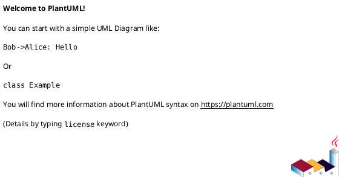

# Объектно-ориентированное программирование<br>Лекция 3. Инкапсуляция и Наследование в Python

Определение и назначение инкапсуляции. Скрытие данных, интерфейс. Модификаторы доступа в Python. `@property`. Наследование: базовые и производные классы. Множественное наследование, MRO, `super()`.

---

# Принципы ООП

1. Абстракция
2. Инкапсуляция
3. Наследование
4. Полиморфизм

---

# Абстракция

> **Абстракция** - принцип ООП, согласно которому объект характеризуется свойствами, которые отличают его от всех остальных объектов и при этом четко определяют его концептуальные границы.

::v-clicks

1. Выделить главные и наиболее значимые свойства предмета.
2. Отбросить второстепенные характеристики.
   ::

<!--
Когда мы имеем дело с составным объектом - мы прибегаем к абстракции. Например, мы должны понимать, что перед нами абстракция, если мы рассматриваем объект как "дом", а не совокупность кирпича, стекла и бетона. А если уже представить множество домов как "город", то мы снова приходим к абстракции, но уже на уровень выше.

Зачем нужна абстракция? Если мыслить масштабно - то она позволяет бороться со сложностью реального мира. Мы отбрасываем все лишнее, чтобы оно нам не мешало, и концентрируемся только на важных чертах объекта.
-->

---

# Инкапсуляция

> **Инкапсуляция** - принцип ООП, согласно которому сложность реализации программного компонента должна быть спрятана за его интерфейсом.

::v-clicks

1. Отсутствует доступ к внутреннему устройству программного компонента.
1. Взаимодействие компонента с внешним миром осуществляется посредством интерфейса, который включает публичные методы и поля.

**Для чего нужна инкапсуляция?**

1. Инкапсуляция упрощает процесс разработки.
2. Повышается надежность программ.
3. Становится более легким обмен компонентами между программами.
   ::

<!--
Абстракция утверждает следующее: "Объект может быть рассмотрен с общей точки зрения". А инкапсуляция от себя добавляет: "И это единственная точка зрения, с которой вы вообще можете рассмотреть этот объект."

Для чего нужна инкапсуляция?
1. Инкапсуляция упрощает процесс разработки, т. к. позволяет нам не вникать в тонкости реализации того или иного объекта.
1. Повышается надежность программ за счет того, что при внесении изменений в один из компонентов, остальные части программы остаются неизменными.
1. Становится более легким обмен компонентами между программами.
-->

---

# Модификаторы доступа

1. `public` - доступны для чтения и записи откуда угодно
2. `protected` - доступны для использования внутри класса и для потомков
3. `private` - доступны для использования только внутри класса

> В Python нет строгих `private` или `protected`, как в Java/C++. Вместо этого используются соглашения об именовании.

---

# `Public` (Публичные атрибуты)

Атрибуты без подчеркиваний. Доступны для чтения и записи откуда угодно. Это стандартное поведение.

```python
class User:
    def __init__(self, name):
        self.name = name # Публичный атрибут

user = User("Alice")
print(user.name)       # OK
user.name = "Bob"      # OK
```

---

# `Protected` (Защищенные атрибуты)

Атрибуты, начинающиеся с одного подчеркивания (`_`). Это сигнал для других разработчиков: "Я — внутренняя часть реализации этого класса. Не трогайте меня напрямую извне, если не уверены в своих действиях".

> Python никак не ограничивает доступ к таким атрибутам. Это просто соглашение.

```python
class BankAccount:
    def __init__(self, amount):
        self._balance = amount # "Защищенный" атрибут

acc = BankAccount(1000)
print(acc._balance) # Технически возможно, но считается плохой практикой
```

---

# `Private` (Приватные атрибуты)

Атрибуты, начинающиеся с двух подчеркиваний (`__`). Python **изменяет (искажает) имя** такого атрибута, чтобы избежать случайных конфликтов имен в дочерних классах. Имя `__balance` внутри класса `BankAccount` превратится в `_BankAccount__balance`.

> Это **не настоящая приватность**, а механизм предотвращения коллизий. Зная новое имя, к атрибуту все еще можно получить доступ.

```python
class BankAccount:
    def __init__(self, amount):
        self.__balance = amount # "Приватный" атрибут

acc = BankAccount(1000)
# print(acc.__balance) # Вызовет AttributeError
print(acc._BankAccount__balance) # Так сработает, но делать так не нужно
```

---

# Декоратор `@property`

````md magic-move
```python
class Person:
    def __init__(self, age):
        self.age = age

p1 = Person(18)
```

```python
class Person:
    def __init__(self, age):
        self.age = age

p1 = Person(18)
p2 = Person(-1)
p3 = Person("twenty")
```

```python
class Person:
    def __init__(self, age):
        self.set_age(age)

    def set_age(self, age):
        if not isinstance(age, int):
            raise TypeError()
        if not 0 <= age < 150:
            raise ValueError()

        self.age = age


p1 = Person(18)
p2 = Person(-1)
p3 = Person("twenty")
```
````

---

# Getter (Получение значения)

Декоратор `@property` над методом превращает его в атрибут, доступный только для чтения.

````md magic-move
```python
class Person:
    def __init__(self, age):
        self._age = age

    @property
    def age(self):
        return self._age


p1 = Person(18)
print(p1.age)
p1.age = 19 # Вызовет AttributeError, т.к. сеттер не определен
```

```python
from datetime import date
class Person:
    def __init__(self, birthday: date):
        self._birthday = birthday

    @property
    def age(self):
        today = date.today()
        age = (today.year - self._birthday.year
               - ((today.month, today.day)
                  < (self._birthday.month, self._birthday.day)
                  )
               )
        return age
```
````

---

# Setter (Установка значения)

Декоратор `@имя_свойства.setter` позволяет определить метод, который будет вызываться при попытке присвоить значение. Здесь и происходит **валидация**.

```python {*|5-8|9-16|9|9-16|18-21}{maxHeight: '340px'}
class Person:
    def __init__(self, age):
        self._age = age

    @property
    def age(self):
        return self._age

    @age.setter
    def age(self, value):
        if not isinstance(value, int):
            raise TypeError()
        if not 0 <= value < 150:
            raise ValueError()

        self._age = value

p1 = Person(25)
print(p1.age)       # 25
p1.age = 30         # OK, вызовется сеттер
p1.age = -5       # Вызовет ValueError
```

---

# Функция `property`

<v-switch>

<template #0-3>

```py {*|5-17|19}{maxHeight: '420px', at: 1}
class Person:
    def __init__(self, age):
        self._age = age

    def get_age(self):
        return self._age

    def set_age(self, value):
        if not isinstance(value, int):
            raise TypeError()
        if not 0 <= value < 150:
            raise ValueError()

        self._age = value

    def del_age(self):
        del self._age

    age = property(get_age, set_age, del_age)
```

</template>
<template #3-5>

```py {*|20-21}{maxHeight: '420px', at: 3}
class Person:
    def __init__(self, age):
        self._age = age


def get_age(self):
    return self._age

def set_age(self, value):
    if not isinstance(age, int):
        raise TypeError()
    if not 0 <= age < 150:
        raise ValueError()

    self._age = value

def del_age(self):
    del self._age

p1 = Person(18)
p1.age = property(get_age, set_age, del_age)
```

</template>
</v-switch>

---

# Наследование

<br>

> **Наследование** - способ создания нового класса на основе уже существующего, при котором класс-потомок заимствует свойства и методы родительского класса и также добавляет собственные.

::v-clicks

1. Класс-потомок = Свойства и методы родителя + Собственные свойства и методы.
1. Класс-потомок автоматически наследует от родительского класса все поля и методы.
1. Класс-потомок может дополняться новыми свойствами.
1. Класс-потомок может дополняться новыми методами, а также заменять(переопределять) унаследованные методы.

> **Отношение "is-a" (является)**: Потомок является разновидностью родителя. Например, `Собака` является `Животным`. `Кнопка` является `ЭлементомИнтерфейса`. Если это отношение не выполняется, наследование, скорее всего, выбрано неверно.
> ::

<!--
Наследование используется в случае, если одни объекты аналогичны другим за исключением нескольких различий. Дадим определение:

1. Класс-потомок = Свойства и методы родителя + Собственные свойства и методы.
2. Класс-потомок автоматически наследует от родительского класса все поля и методы.
3. Класс-потомок может дополняться новыми свойствами.
4. Класс-потомок может дополняться новыми методами, а также заменять(переопределять) унаследованные методы. Переопределить родительский метод - это как? Это значит, внутри класса потомка есть метод, который совпадает по названию с методом родительского класса, но функционал у него новый - соответствующий потребностям класса-потомка.
-->

---

# Наследование

::center
<v-switch>
<template #0>



</template>
<template #1>


</template>
<template #2>


</template>
<template #3>


</template>
</v-switch>
::

---

# Наследование

```python
class Parent:
    # ...

class Child(Parent):
    # ...
```

---

# Наследование

```python {*}{maxHeight: '420px'}
class Animal:
    def __init__(self, name):
        self.name = name

    def speak(self):
        raise NotImplementedError("Потомок должен реализовать этот метод")

class Dog(Animal):
    def speak(self):  # Переопределение метода родителя
        return f"{self.name} говорит Гав!"

class Cat(Animal):
    def purr(self):   # Расширение - новый метод
        return f"{self.name} мурлычет"

    def speak(self):  # Переопределение метода родителя
        return f"{self.name} говорит Мяу!"
```

---

# `super()`

Встроенная функция `super()` предоставляет доступ к методам родительского класса.

```python {*|10-14|12|2-4|16-20|17-18|}{maxHeight: '370px'}
class Employee:
    def __init__(self, name, salary):
        self.name = name
        self.salary = salary

    def display_info(self):
        print(f"Имя: {self.name}, Зарплата: {self.salary}")

class Manager(Employee):
    def __init__(self, name, salary, department):
        # Сначала вызываем __init__ родителя, чтобы он сделал свою работу
        super().__init__(name, salary)
        # Затем добавляем свою логику
        self.department = department

    def display_info(self):
        # Сначала вызываем метод родителя
        super().display_info()
        # Затем дополняем его вывод
        print(f"Отдел: {self.department}")
```

---

# Множественное Наследование и MRO (Method Resolution Order)

````md magic-move
```python
class Child(Parent1, Parent2):
    # ...
```

```python
class A:
    def info(self): print("In class A")

class B(A):
    def info(self): print("In class B")

class C(A):
    def info(self): print("In class C")

class D(B, C):
    pass

d = D()
d.info()
```

```python
class A:
    def info(self): print("In class A")

class B(A):
    def info(self): print("In class B")

class C(A):
    def info(self): print("In class C")

class D(B, C):
    pass

d = D()
d.info()  # Выведет "In class B"
```

```python
class A:
    def info(self): print("In class A")

class B(A):
    def info(self): print("In class B")

class C(A):
    def info(self): print("In class C")

class D(B, C):
    pass

d = D()
d.info()  # Выведет "In class B"
print(D.__mro__)
# Выведет: (<class '__main__.D'>, <class '__main__.B'>, <class '__main__.C'>, <class '__main__.A'>, <class 'object'>)
```
````

---

# Множественное Наследование и MRO (Method Resolution Order)

Множественное наследование — мощный, но опасный инструмент. Часто его **можно** и **нужно** заменять композицией или миксинами.
